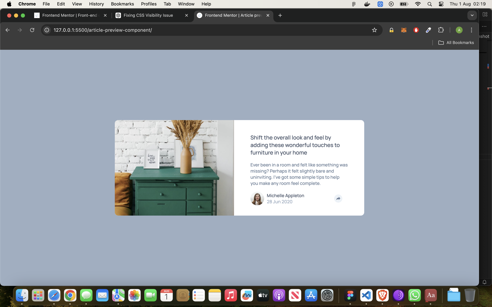

# Frontend Mentor - Article preview component solution

This is a solution to the [Article preview component challenge on Frontend Mentor](https://www.frontendmentor.io/challenges/article-preview-component-dYBN_pYFT). Frontend Mentor challenges help you improve your coding skills by building realistic projects. 

## Table of contents

- [Overview](#overview)
  - [The challenge](#the-challenge)
  - [Screenshot](#screenshot)
  - [Links](#links)
- [My process](#my-process)
  - [Built with](#built-with)
  - [What I learned](#what-i-learned)
  - [Continued development](#continued-development)

## Overview

### The challenge

Users should be able to:

- View the optimal layout for the component depending on their device's screen size
- See the social media share links when they click the share icon

### Screenshot

### Links

- Solution URL: [GitHub](https://github.com/Sharky83/frontend-mentour-challenges/tree/main/Js/article-preview-component)
- Live Site URL: [Vercel](https://frontend-mentour-challenges.vercel.app/Js/article-preview-component/)

## My process

### Built with

- Semantic HTML5 markup
- CSS custom properties
- Flexbox
- Mobile-first workflow
- Javascript

**Note: These are just examples. Delete this note and replace the list above with your own choices**

### What I learned

Learned how to create eventListner in Javascript, and implemented it on the social icon. 

### Continued development

### Useful resources

web.dev and mdn.docs has been useful to learn from.

