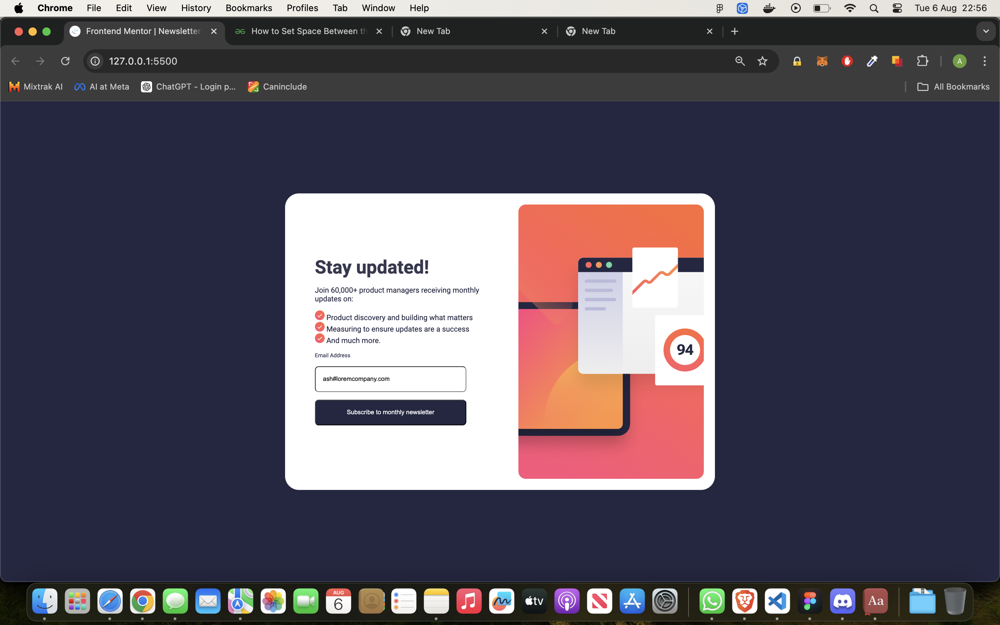

# Frontend Mentor - Newsletter sign-up form with success message solution

This is a solution to the [Newsletter sign-up form with success message challenge on Frontend Mentor](https://www.frontendmentor.io/challenges/newsletter-signup-form-with-success-message-3FC1AZbNrv). Frontend Mentor challenges help you improve your coding skills by building realistic projects. 

## Table of contents

- [Overview](#overview)
  - [The challenge](#the-challenge)
  - [Screenshot](#screenshot)
  - [Links](#links)
- [My process](#my-process)
  - [Built with](#built-with)
  - [What I learned](#what-i-learned)
  - [Continued development](#continued-development)

## Overview

### The challenge

the form doesnt validate email yet! this wil be added shortly.

### Screenshot

- Solution URL: [Github](https://github.com/Sharky83/frontend-mentour-challenges/tree/main/Js/newsletter-sign-up-with-success-message)
- Live Site URL: [Vercel](https://your-live-site-url.com)

newsletter-sign-up-with-success-message

## My process

### Built with

- Semantic HTML5 markup
- CSS custom properties
- Flexbox
- Mobile-first workflow
- Javascript

### What I learned

i learned how to create a pop up modal that could be used on a sign up ,the modal then closes with a click of a button or off the screen.

i need to tidy up the css for responsiveness on tablets.

and add the javascript for email validation.

