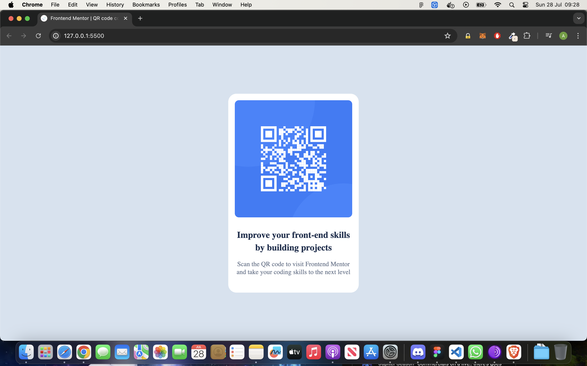

# Frontend Mentor - QR code component solution

This is a solution to the [QR code component challenge on Frontend Mentor](https://www.frontendmentor.io/challenges/qr-code-component-iux_sIO_H). Frontend Mentor challenges help you improve your coding skills by building realistic projects. 

## Table of contents

- [Overview](#overview)
  - [Screenshot](#screenshot)
  - [Links](#links)
- [My process](#my-process)
  - [Built with](#built-with)
  - [What I learned](#what-i-learned)
  - [Continued development](#continued-development)
  - [Useful resources](#useful-resources)
- [Author](#author)
- [Acknowledgments](#acknowledgments)

**Note: Delete this note and update the table of contents based on what sections you keep.**

## Overview

### Screenshot

### Links

- Solution URL: [https://github.com/Sharky83/QR-code-component](https://github.com/Sharky83/QR-code-component)
- Live Site URL: [https://qr-code-component-eta-teal.vercel.app/](https://qr-code-component-eta-teal.vercel.app/)

## My process

### Built with

- CSS custom properties
- Flexbox

### What I learned

Learned the basics of flexbox.

### Continued development

Learn more functionality of flexbox

### Useful resources

- [Web Dev](https://web.dev/learn/css) - This helped me get the basics of flexbox

## Author

- Website - [Alex](https://github.com/Sharky83/)
- Frontend Mentor - [@Sharky83](https://www.frontendmentor.io/profile/Sharky83)

## Acknowledgments

