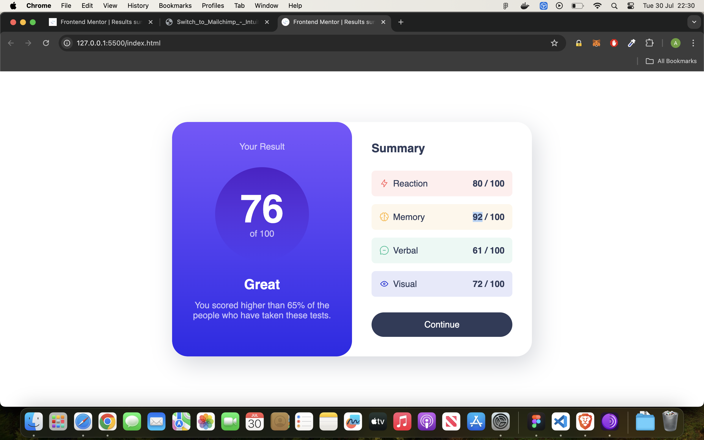

# Frontend Mentor - Results summary component solution

This is a solution to the [Results summary component challenge on Frontend Mentor](https://www.frontendmentor.io/challenges/results-summary-component-CE_K6s0maV). Frontend Mentor challenges help you improve your coding skills by building realistic projects. 

## Table of contents

- [Overview](#overview)
  - [The challenge](#the-challenge)
  - [Screenshot](#screenshot)
  - [Links](#links)
- [My process](#my-process)
  - [Built with](#built-with)
  - [What I learned](#what-i-learned)
  - [Continued development](#continued-development)
 
**Note: Delete this note and update the table of contents based on what sections you keep.**

## Overview

### The challenge

Users should be able to:

- View the optimal layout for the interface depending on their device's screen size
- See hover and focus states for all interactive elements on the page
- **Bonus**: Use the local JSON data to dynamically populate the content
(did not do this bit, maybe i will try this again)

### Screenshot



### Links

- Solution URL: [Github](https://github.com/Sharky83/frontend-mentour-challenges/tree/main/html-css/results-summary-component)
- Live Site URL: [Vercel](https://frontend-mentour-challenges.vercel.app/html-css/results-summary-component/)

## My process

### Built with

- HTML5 markup
- CSS custom properties
- Flexbox
- CSS Grid


### What I learned

I implemented a lot of new things, in the tutorials I watched today - in regards to using (data item type) to allow accent colours to be added to the svgs.  I also deep dived into custom variables, and sank a lot of these into it! however I wont be doing this for simple designs again, I can see how it would really benefit a large development though.


```css
.this-css[data-item-type="accent-3"] {
    --item-color: var(--clr-accent-3);
}

```


### Continued development

deeper dive into margins and repetiveness, so i can get spacing more quickly - love to memorise the rem numbers for corresponding px.

### Useful resources

Kevin Pwell on Youtube - been really good at explaining the consepts I implemented.
