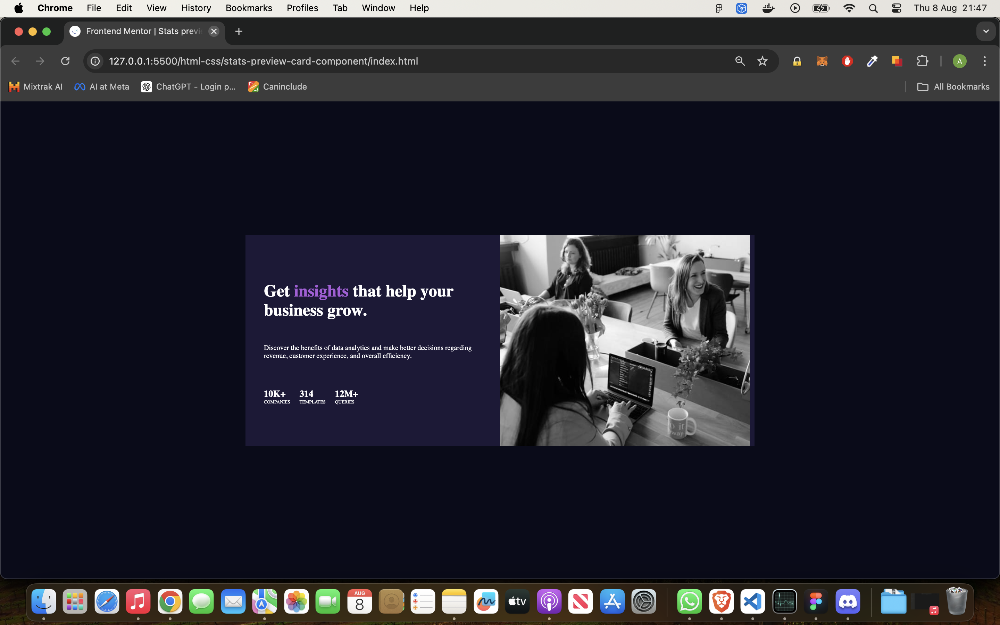

# Frontend Mentor - Stats preview card component solution

This is a solution to the [Stats preview card component challenge on Frontend Mentor](https://www.frontendmentor.io/challenges/stats-preview-card-component-8JqbgoU62). Frontend Mentor challenges help you improve your coding skills by building realistic projects. 

## Table of contents

- [Overview](#overview)
  - [The challenge](#the-challenge)
  - [Screenshot](#screenshot)
  - [Links](#links)
- [My process](#my-process)
  - [Built with](#built-with)
  - [What I learned](#what-i-learned)
  - [Continued development](#continued-development)

## Overview

### The challenge

Users should be able to:

- View the optimal layout depending on their device's screen size

### Screenshot

### Links

- Solution URL: [Add solution URL here](https://github.com/Sharky83/frontend-mentour-challenges/tree/main/html-css/stats-preview-card-component)
- Live Site URL: [Add live site URL here](https://frontend-mentour-challenges.vercel.app/html-css/stats-preview-card-component/)

## My process

### Built with

- Semi-Semantic HTML5 markup
- CSS custom properties
- Flexbox
- CSS Grid

### What I learned

continued practice of html and css

### Continued development

would like to focus more on using code that selects multiple elements withing a container to style.

such my use of:

.results > div:last-child {
  margin-right: 0;
}

